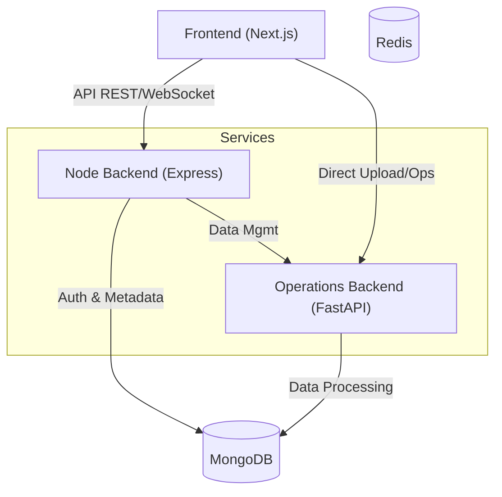
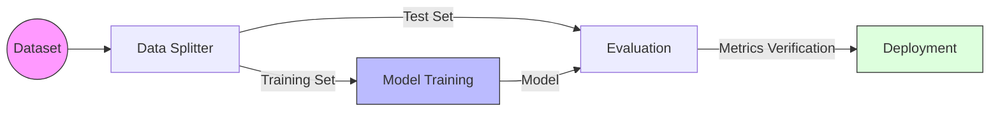

# AutoML Studio

**AutoML Studio** is a powerful No-Code Machine Learning Platform that empowers users to build, train, and evaluate machine learning models using an intuitive drag-and-drop interface. Whether you are a data scientist or a beginner, AutoML Studio streamlines the complex process of ML workflows into simple, visual steps.


## Key Features

*   **Visual Workflow Builder**: Create complex ML pipelines by dragging and dropping nodes (powered by `@xyflow/react`).
*   **No-Code Interface**: Perform data preprocessing, cleaning, and model training without writing a single line of code.
*   **Multi-Backend Architecture**: Robust microservices architecture for scalability and performance.
*   **Real-time Analysis**: Interactive data visualization and analysis tools.
*   **Secure Authentication**: Integrated user management and authentication system.

---

## System Architecture

The project follows a microservices architecture to ensure modularity and scalability.



### Components

1.  **Frontend (`/frontend`)**:
    *   **Tech Stack**: Next.js 16, React 19, Redux Toolkit, Tailwind CSS.
    *   **Role**: The user interface for designing workflows and managing datasets. Features the drag-and-drop canvas.

2.  **Node Backend (`/node-backend`)**:
    *   **Tech Stack**: Express.js, TypeScript, Mongoose.
    *   **Role**: Acts as the primary API gateway. Handles user authentication, project management, and orchestration between services.

3.  **Operations Backend (`/operations-backend`)**:
    *   **Tech Stack**: FastAPI.
    *   **Role**: Dedicated service for high-throughput data operations, dataset processing, and file management.

---

## Getting Started

### Prerequisites

*   [Node.js](https://nodejs.org/) (v18+)
*   [Python](https://www.python.org/) (v3.10+)
*   [MongoDB](https://www.mongodb.com/) (Local or Atlas)
*   [Redis](https://redis.io/) (For task queues)

### Installation & Setup

#### 1. Frontend
```bash
cd frontend
npm install
npm run dev
# Running on http://localhost:5173
```

#### 2. Node Backend
```bash
cd node-backend
npm install
npm run dev
# Running on http://localhost:3000
```

#### 3. Operations Backend
```bash
cd operations-backend
python -m venv venv
.\venv\Scripts\activate
pip install -r requirements.txt
python run.py
# Running on http://localhost:8001 (approx)
```

---

## Workflow Example

Here is a visual representation of a typical machine learning workflow you can build in AutoML Studio:



## Development

*   **Frontend**: Built with Next.js App Router. Workflows are managed using React Flow (xyflow).
*   **Backend Communication**: Services communicate via REST APIs. Long-running ML tasks are offloaded to background workers via Redis queues.

## Contributing

Contributions are welcome! Please feel free to submit a Pull Request.
